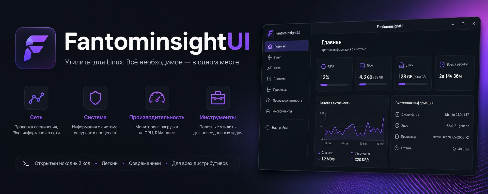
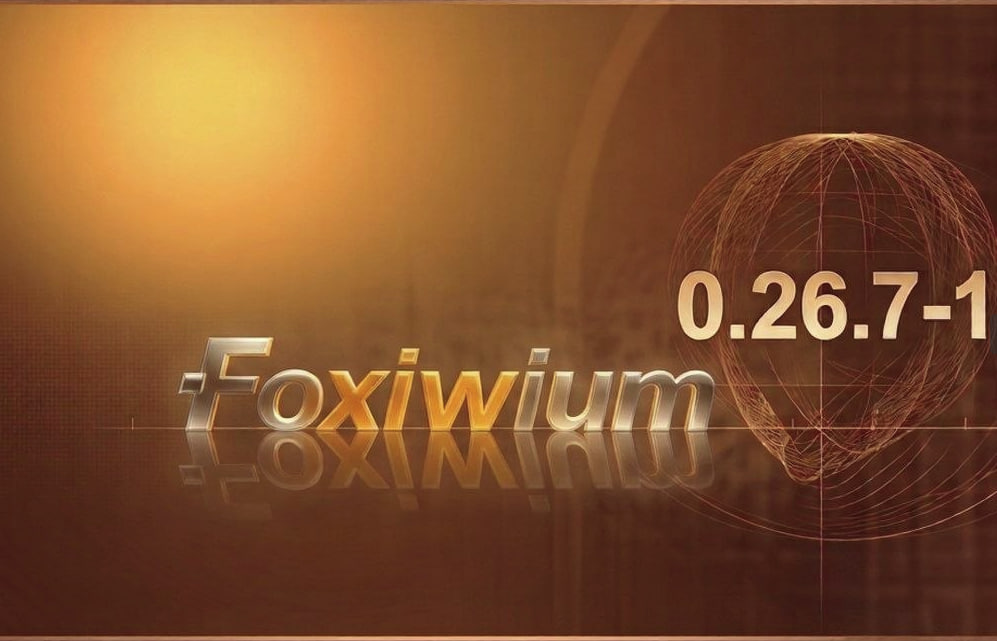
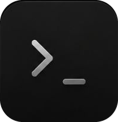
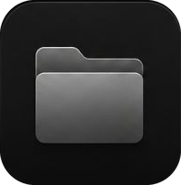

# Foxiwium OS



**Hobby-операционная система с нуля для x86_64**  
Собственное ядро, графический рабочий стол, сетевой стек и приложения — без Linux и без libc.

> Совместный проект **Fantominsight** и **Oxiwis**.  
> Цель — понятная система для новичков и при этом интересная площадка для экспериментов с OS-dev.

---

## Скриншоты

| Desktop / Wallpaper | Browser | Terminal |
|:---:|:---:|:---:|
|  |  |  |

| Text Editor | File Manager | Boot |
|:---:|:---:|:---:|
|  |  |  |

---

## Возможности

### Ядро
- x86_64 long mode, Multiboot2 + GRUB
- GDT / IDT / PIC / PIT, page fault handling
- Physical & virtual memory manager (PMM / VMM)
- Kernel heap
- Процессы + syscalls (SYSCALL/SYSRET)
- VFS + initramfs (cpio)
- ELF-loader (пользовательские процессы)

### Графика и GUI
- Framebuffer (Multiboot2), double-buffering
- Тема **Liquid Glass** / KDE Breeze Dark
- Окна: перетаскивание, ресайз, snap к краям экрана
- Нижняя панель, лаунчер приложений, контекстное меню, меню питания
- Встроенные шрифты и обои

### Приложения
| Приложение | Описание |
|---|---|
| **Files** | Файловый менеджер на VFS (навигация, sidebar) |
| **Terminal** | Оболочка с реальными командами (`ping`, `curl`, `wget` и др.) |
| **Browser** | HTTP-браузер, поиск через Bing RSS |
| **Calculator** | Калькулятор |
| **Text Editor** | Простой текстовый редактор |
| **Settings** | Настройки |
| **System Monitor** | Информация о системе, память, uptime |
| **About** | О системе |

### Сеть
- Драйвер **RTL8139** (PCI)
- ARP, IPv4, ICMP (ping), UDP, DNS, TCP
- HTTP/1.1 (синхронный и асинхронный)
- В QEMU работает через user-mode networking (`-nic user,model=rtl8139`)

> **Пока нет TLS/HTTPS** — большинство современных сайтов недоступны.  
> Подробности и планы — в [ROADMAP.md](ROADMAP.md).

---

## Сборка и запуск

### Требования
- `nasm`, `g++` / `gcc` (или кросс-компилятор `x86_64-elf-`)
- `grub-mkrescue` (для ISO)
- `qemu-system-x86_64`
- `cpio`, `xxd`

### Сборка

```bash
make          # ядро + shell + initramfs + ISO → build/foxiwium.iso
# или по шагам:
make kernel
make iso
```

### Запуск в QEMU

```bash
make run
# или вручную:
qemu-system-x86_64 -cdrom build/foxiwium.iso -m 512M \
  -display sdl -accel kvm -nic user,model=rtl8139
```

Без KVM (для отладки таймингов):

```bash
qemu-system-x86_64 -cdrom build/foxiwium.iso -m 512M \
  -accel tcg,thread=single -nic user,model=rtl8139
```

Серийный вывод / debugcon:

```bash
qemu-system-x86_64 -cdrom build/foxiwium.iso -m 512M \
  -debugcon file:/tmp/fox_dbg.log -nic user,model=rtl8139
tr -d '\0' < /tmp/fox_dbg.log
```

### Другие цели Makefile

| Цель | Описание |
|------|----------|
| `make kernel` | Только ядро (`build/foxiwium.bin`) |
| `make iso` | Загрузочный ISO |
| `make disk` | Сырой образ диска |
| `make run` | Запуск ISO в QEMU |
| `make run-nographic` | Без графики, serial stdio |
| `make debug` | QEMU + GDB |
| `make clean` | Очистка `build/` |

---

## Структура репозитория

```
.
├── kernel/
│   ├── main.cpp              # Точка входа, рабочий стол, панель, главный цикл
│   ├── apps/                 # Приложения (browser, calculator, editor, …)
│   ├── arch/                 # GDT, CPU
│   ├── boot/                 # boot.asm
│   ├── crypto/               # AES, SHA-256, RSA, ECC, X.509 (заготовка под TLS)
│   ├── drivers/              # RTL8139, net stack, PS/2, PIT, PIC, …
│   ├── fs/                   # VFS, initramfs, ELF loader
│   ├── graphics/             # Framebuffer, font, wallpaper, boot splash
│   ├── gui/                  # Оконная система
│   ├── mm/                   # PMM, VMM, heap
│   ├── proc/                 # Процессы, context switch
│   ├── syscall/              # Syscall entry + handlers
│   └── userspace/            # Встроенный shell-бинарь
├── grub/                     # Конфиги GRUB (BIOS / UEFI)
├── initramfs/                # Минимальный init
├── scripts/                  # build-initramfs, create-iso, create-disk
├── Makefile
├── ROADMAP.md                # Состояние проекта и планы
└── LICENSE                   # GNU GPLv3
```

---

## Дорожная карта

Актуальный статус, известные баги, план по TLS и USB/XHCI/Wi‑Fi — в **[ROADMAP.md](ROADMAP.md)**.

Кратко приоритеты:

1. Интернет (редиректы → TLS/HTTPS)
2. Работа с файлами (VFS)
3. Терминал
4. Настройки, TTY, экраны паники, мультимедиа

---

## Лицензия

[GNU General Public License v3.0](LICENSE)

---

**Foxiwium OS** — hobby OS built from scratch.  
Сделано с любовью к низкоуровневому коду.
